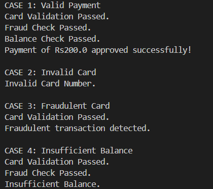
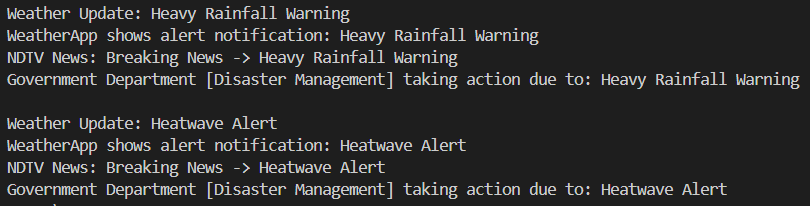

# Behavioral Design Patterns in Java

## Overview

This project shows two **Behavioral Design Patterns** with real-world examples:

* **Chain of Responsibility (CoR):** Payment Processing System
* **Observer Pattern:** Weather Alert System

---

## How It Works

* **Chain of Responsibility:** A payment request goes through multiple checks (Card Validation → Fraud Check → Balance Check → Final Approval). Each handler does one job and forwards the request.
* **Output Screenshot:** 

* **Observer:** A WeatherStation notifies all subscribed observers (MobileApp, NewsAgency, GovernmentDepartment) whenever the weather changes.
* **Output Screenshot:** 

---

## Run Instructions

```bash
# Run Chain of Responsibility
javac com/paymentsystem/*.java
java com.paymentsystem.CORDemo

# Run Observer
javac com/weatheralertsystem/*.java
java com.weatheralertsystem.ObserverDemo
```
